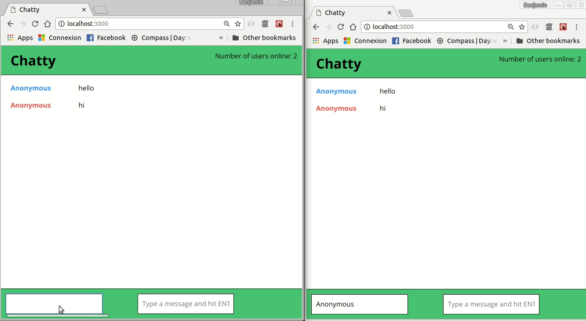
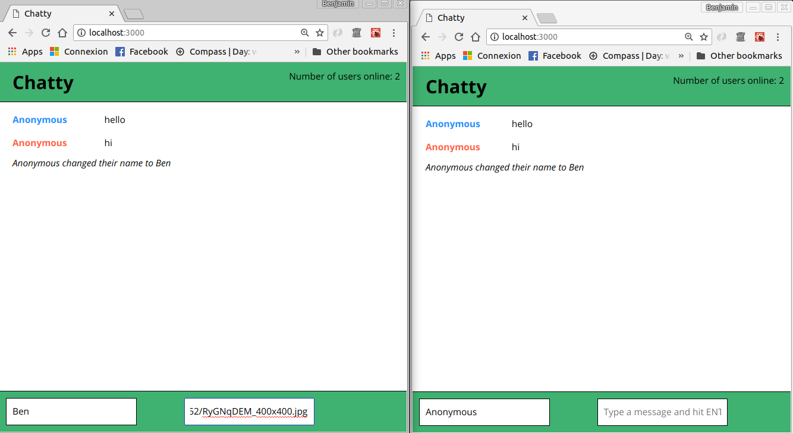
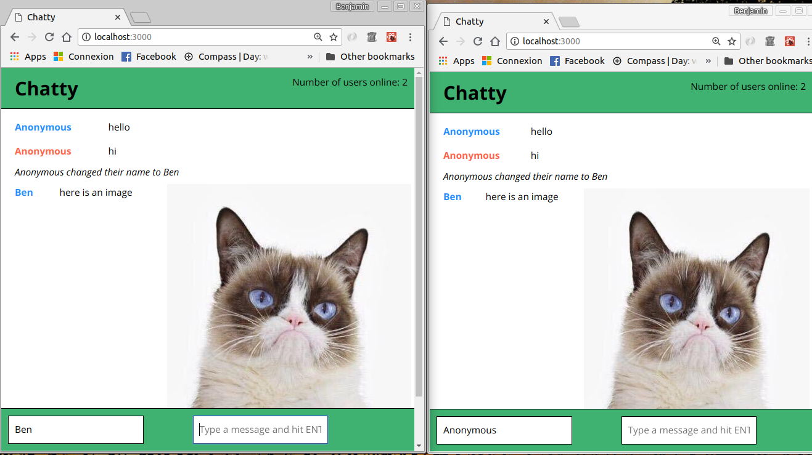

ChattyApp
=====================

A full stack chat web app built with Node, Express, React, Webpack and Babel. It assigns a random colour to each user upon connection, allows users to change their username and to communicate in real time. It recognizes image urls in messages and displays them as images.

### Final Product

Displays messages and notifications for all connected users on real time.

Allows users to post the url of an image

It recognizes it and displays it as an image

### Getting Started

Fork this repository, then clone your fork of this repository.
Install dependencies using the npm install command.
Start the web server using the npm start command. The app will be served at http://localhost:3000/.
In the chatty_server directorym start the websocket server using the npm start command. The web-socket server will run on port 3001.
Go to http://localhost:3000/ in your browser

### Dependencies

* React
* Webpack
* [babel-loader](https://github.com/babel/babel-loader)
* [css-loader](https://github.com/webpack-contrib/css-loader)
* [webpack-dev-server](https://github.com/webpack/webpack-dev-server)
